# Ajaia Docs - AI-Native Full Stack Developer Assignment

A lightweight, collaborative document editor built for the Ajaia LLC engineering assignment.

## Tech Stack
- **Framework:** Next.js 15 (App Router)
- **Styling:** Tailwind CSS + Lucide React (Icons)
- **Editor:** Tiptap (ProseMirror wrapper for rich text)
- **Database:** MongoDB (via Mongoose)
- **Testing:** Node.js Native Test Runner (`node:test`)

## Features
- **Document Editing:** Rich text formatting (Bold, Italic, Underline, Headers, Lists) using Tiptap.
- **File Upload:** Upload `.txt` and `.docx` files to instantly create a new editable document.
- **Sharing:** Mock authentication allows sharing documents via email. Distinct views for "Owned" and "Shared" documents.
- **Persistence:** Documents are saved to a MongoDB cluster.

## Architecture Diagram


*(Note: If the image above does not load, please save your screenshot as `architecture.png` in the root folder! Alternatively, here is the text-based Mermaid version of the exact same diagram:)*

```mermaid
graph LR
    subgraph Users
        U1[Alice - Owner]
        U2[Bob - Collaborator]
    end

    subgraph Frontend[Next.js Frontend]
        F1[Login / Logout]
        F2[Dashboard]
        F3[Document Editor - Tiptap]
        F4[File Upload]
        F5[Share Document]
    end

    Users --> Frontend

    subgraph API[Next.js API Routes]
        A1[POST /api/login]
        A2[GET /api/docs]
        A3[PUT /api/docs/:id]
        A4[POST /api/upload]
        A5[POST /api/docs/:id/share]
    end

    Frontend -- "HTTP Requests" --> API

    subgraph DB[MongoDB Atlas]
        D1[(Users Collection)]
        D2[(Documents Collection)]
    end

    API -- "Mongoose ODM" --> DB
```



## Local Setup Instructions

1. **Install Dependencies**
   ```bash
   npm install
   ```

2. **Environment Variables**
   Create a `.env.local` file in the root directory and add your MongoDB connection string:
   ```env
   MONGODB_URI=mongodb+srv://<username>:<password>@cluster0.mongodb.net/ajaia_editor?retryWrites=true&w=majority
   ```

3. **Database Seeding (Mock Users)**
   The app uses a mock authentication system. To seed the database with the test users, start the dev server and visit:
   `http://localhost:3000/api/seed`
   This creates two users:
   - `alice@example.com`
   - `bob@example.com`

4. **Run the Application**
   ```bash
   npm run dev
   ```
   Open `http://localhost:3000` and sign in using one of the seeded emails.

5. **Run Tests**
   ```bash
   npm run test
   ```
